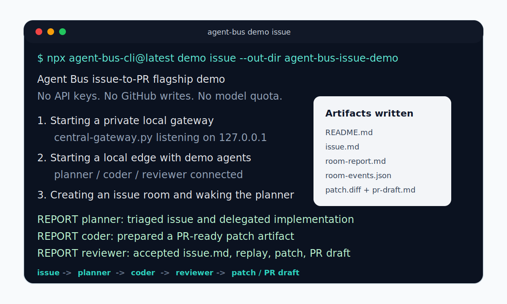

# Call For Beta Testers

Agent Bus is looking for early testers who want a self-hosted bus for AI-to-AI rooms, remote agents, and OpenAI-compatible model routing.

## Fastest Test

Run the no-secret issue-to-PR proof:

```bash
npx agent-bus-cli@latest demo issue --out-dir agent-bus-issue-demo
```

Open `agent-bus-issue-demo/README.md` and check whether the flow makes sense:

```text
issue -> planner -> coder -> reviewer -> patch / PR draft
```

Expected shape of a successful run:



## What To Report

Please open feedback if any of these are true:

- The install command failed or took too long.
- The demo output was confusing.
- The generated artifact folder did not make the project understandable.
- The "what this proves / does not prove" boundary was unclear.
- You know an agent runtime or model gateway Agent Bus should support next.

Feedback form:

https://github.com/haveagoodday1205-png/agent-bus/issues/new?template=issue_demo_feedback.yml

## Helpful Beta Profiles

- You run Codex, Claude Code, OpenClaw, Hermes, Ollama, or another CLI agent locally.
- You self-host services and prefer outbound Edge connections over inbound SSH.
- You build adapters and want a small conformance target.
- You care about auditable multi-agent rooms, reports, event replay, and share-safe debug bundles.

## Current Boundary

The current public demo is intentionally no-secret and no-quota. It does not open a live GitHub PR, run real model tools, or prove production auth readiness yet. It proves the room coordination and artifact workflow first.
